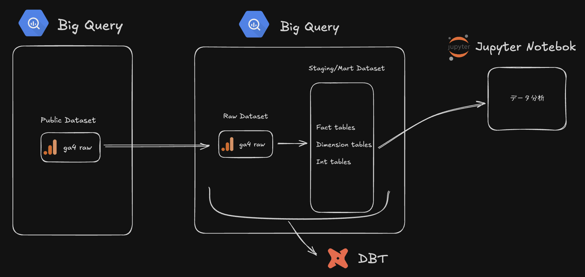

## GA4 × BigQuery × dbt でつくる分析パイプライン

このリポジトリは、Google Analytics 4 のエクスポートデータを BigQuery 上でモデリングし、Jupyter Notebook からマーケティング・顧客のインサイトを導出するまでを一気通貫で構築したプロジェクトです。実務に近い形で「データ取得 → 変換 → マート化 → 可視化・分析」までを再現しています。

---

## プロジェクト概要（全体像）
- **データ基盤**: BigQuery
- **変換/モデリング**: dbt Core + `Velir/ga4` パッケージ（GA4用モデル定義）
  - *ポイント*: パッケージの標準モデルの一部を、提供サンプルとスキーマ差分があっても動くように上書き実装
- **ノートブック**: Jupyter Notebook で可視化・分析

---

## テップごとの実装
1) **GCP ・ dbt のセットアップ**
   - BigQuery プロジェクト/データセットを準備し、ローカルから dbt Core で接続
   - 認証・実行設定は `dbt_project/profiles.yml` で環境変数ベースに管理（`.env` から読み込み）

2) **GA4 公開データを BigQuery に取り込む**
   - 公開サンプルの GA4 データを自身の BigQuery にコピーし、分析用の Raw データセットとして使用

3) **dbt で GA4 を事前定義モデルにより正規化**
   - `dbt_packages` の `Velir/ga4` を導入（[packages.yml](mdc:dbt_project/packages.yml)）
   - 公開サンプルデータ古く、最新版に対応しているパッケージとの衝突が起きたので、 `base_ga4__events` を無効化し、公開データ差分に合わせて上書き
     - 無効化設定: [dbt_project.yml](mdc:dbt_project/dbt_project.yml) の `+enabled: false`
     - 上書き実装: [base_ga4__events.sql](mdc:dbt_project/models/overrides/staging/base/base_ga4__events.sql)
     - 主な調整点:
       - `device.browser` など新しいフィールドを除外し `device.web_info.*` へ置換
       - UTM 相当の `source/medium/campaign/...` を `event_params` から抽出し正規化
       - `ga_session_id` / `ga_session_number` などセッション情報を抽出、重複排除を実装
       - 日付パーティション（`event_date_dt`）での増分処理（insert_overwrite）を採用

4) **ファクト/ディメンションの作成（マート化）**
   - パッケージのモデルから日次のセッション指標や属性テーブルを生成

5) **Jupyter Notebook で分析**
   - Notebook では下記の主要テーブルを使用:
     - `fct_ga4__sessions_daily`（セッション指標: ページビュー、エンゲージメント など）
     - `dim_ga4__sessions_daily`（チャネルグルーピング、日付などの属性）
   - BigQuery から Notebook に読み込み、時系列・チャネル・セグメント（新規/既存）で可視化
   - ノートブック: [data_analysis.ipynb](mdc:data_analysis.ipynb)

---

## 分析サマリー（抜粋）
- **チャネル別のトラフィック**: Direct / Organic Search / Referral が主要な流入源。複数チャネルが同時にピークを迎える期間があり、セール・新製品リリースなどの全体施策によるリフトを示唆。
- **季節性**: 年末にディップが確認でき、季節イベントや施策停止の影響が示唆される。
- **新規/既存セグメント**: 新規比率が高く、新規ユーザーのエンゲージメントが相対的に高い傾向。既存ユーザー向けの再訪促進・活性化（例: リマーケ、オンボーディング強化）に改善余地。
- **運用示唆**: `Unassigned` が一定量あるため、UTM・チャネル定義の整備で計測精度を改善。Referral は質の高いパートナーの特定・深耕が有効。

---

## リポジトリ構成
- [run_dbt.sh](mdc:run_dbt.sh): 環境変数を読み込み、dbt を実行
- [dbt_project.yml](mdc:dbt_project/dbt_project.yml): 変数・モデル設定（GA4 パッケージのモデル無効化を含む）
- [profiles.yml](mdc:dbt_project/profiles.yml): BigQuery 接続設定（環境変数参照）
- [packages.yml](mdc:dbt_project/packages.yml): `Velir/ga4` の依存定義
- [base_ga4__events.sql](mdc:dbt_project/models/overrides/staging/base/base_ga4__events.sql): GA4 イベント基盤テーブルの上書き実装
- [data_analysis.ipynb](mdc:data_analysis.ipynb): マーケティングチャネル/新規・既存分析の可視化

---

## 参考
- GA4 向け dbt モデル: [Velir/ga4 パッケージ](https://hub.getdbt.com/Velir/ga4/latest/)
- 設計の参考記事: [Google Analytics, BigQuery & dbt – A dbt example project](https://stacktonic.com/article/google-analytics-big-query-and-dbt-a-dbt-example-project)
